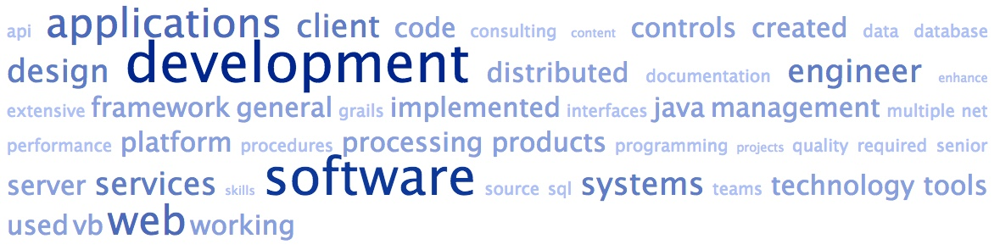

**Mariusz Jurgielewicz**

<mariusz.jurgielewicz@comcast.net>

**SUMMARY**

Experienced software engineer skilled in all phases of the software
development lifecycle:

-   Expertise in software engineering fundamentals.

-   Proven ability to build high performance, secure, data-driven
    applications with quality code.

-   Strong understanding of Java, web services, SQL, XML, database and
    object-oriented development.

-   Solid knowledge of concepts and procedures of common software
    development methodologies.

-   Extensive experience with database design, algorithm development,
    source control, multi-threaded software development environments.

-   Design, develop and implement large-scale enterprise level
    distributed software systems.

-   Known for ability to work with diverse consulting groups, business
    partners, designers, product developers, QA teams, and clients.

**EXPERIENCE**

**Associate Staff Software Developer** March 2015 - Present

**QIAGEN**, Redwood City, California
 
-   Implemented status reporting functionality in existing web and
    command line utilities to enhance multi-threaded processes
    visibility.

-   Re-architected common application domain objects, services, and
    tools into Grails plugin to improve code reusability. Kept plugin
    synchronized with multiple version of Grails platform.

-   Performed continuous refinement and improvement of existing CI
    framework.

-   Migrated multiple projects to the latest version of Grails.

-   Increased performance, extensibility, manageability and testability
    of the code.

-   Integrated front-end technologies, servlet web frameworks, Hibernate
    and Spring, and an Oracle database.

-   Collaborated with geographically distributed teams on multiple
    development projects.

**Senior Software Engineer** July 2007 – March 2015

**Xerox Content Management**, Palo Alto, California
-   Built scalable Restful web services (API) for Enterprise Content
    Management server platform using open source software.

-   Developed extensible high-speed multithreaded document intake module
    which allowed up to 100 docs/s upload rate.

-   Provided technical guidance and mentored less experienced team
    members.

-   Used working knowledge of the platform to resolve
    development-related questions across a variety of supported
    development platforms using many different development interfaces.

-   Trained software developers how to use various technologies through
    code samples, developer guides, quick starts, tutorials, API
    reference, quick references, online help, web articles.

**Senior Software Engineer** April 2006 – May 2007

**Saratoga Systems**, Campbell, California
-   Developed client UI in C++/C\# and the web based clients using
    ActiveX and ASP for a line of CRM software products.

-   Used .NET Remoting and web services to create interfaces for
    client-server applications.

-   Generated documentation required in the software development
    process, including software requirements specifications, software
    design descriptions, verification and validation plans, and other
    items as required.

**Senior Software Engineer** August 2000 – March 2006

**Network General**, San Jose, California

-   Developed distributed network monitoring and analysis products.
    Created distributed multi-language client-server Windows application
    in C++/C#. Worked on communication layer using DCOM and TCP/UDP
    protocols. Used XSLT transformation to generate structures that can
    be used both for C/C++ and C# side.

-   Made client-side user controls those facilitate some third-party
    chart, grid, diagramming controls. All controls used ADO.NET tables
    as the data source.

-   Wrote scripts that use NAnt build tool for Continuous Integration,
    Unit Testing, generating setup, creating documentation, etc. Created
    installation programs and deployment procedures for several products
    using InstallShield or Visual Studio deployment tools.

**Programmer/Analyst** June 1999 – June 2000

**Horizon Computer Consulting**, Des Moines, Iowa

-   Provided system/programming services in the form of consulting,
    analysis, design, programming and general maintenance of client data
    processing systems

-   Developed client/server applications using VB, VBSQL, ODBC and ADO.

**Software Developer** June 1995 – June 1999

**Swiss Soft Ltd**, Wroclaw, Poland

-   Developed project-controlling systems working on Windows GUI
    environment using C++ and Win32 API.

-   Implemented client/server applications using VB and SQL Server.

-   Localized applications for customers in German, English, French and
    Polish speaking markets.

-   Prepared installation procedures for company's software using
    InstallShield.

-   Created interfaces to Crystal Reports in C++ and VB

**EDUCATION**

**Engineering Administration/Data processing Management Systems, Master
of Science** September 1988 – September 1993

**Wroclaw University of Technology**, Wroclaw, Poland

**Skills**
|**Languages**|**Technology**|**Tools**|
|-|-|-|
|Java|REST|SVN
|Groovy|Web Services|Ant
|C#|Spring Framework|Eclipse
|C/C++|Hibernate|Git
|XQuery|GORM|Jira
|VB|OKBC|Jenkins
|HQL|SQL|YourKit
|XSLT|Google Apps Script|Visual Studio
|SPARQL|jQuery|
||JSON|
||Restlet|
||XML|
||JDOM|
||XPath|
||SAX|
||Guice|
||XForms|
||RelaxNG|
||WADL|
||L34T|
||.NET|
||HTML|
||HTTP|
||SOAP|
||TestNG|
||Mockito|

