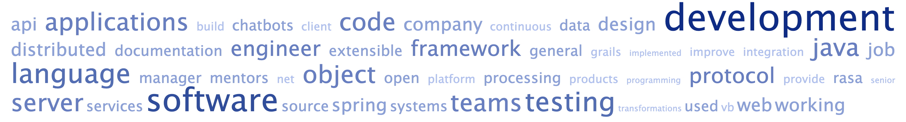

<table width="100%">
  <tr>
    <td>
      <h1>MARIUSZ JURGIELEWICZ</h1>
      
<strong>Software Engineering Leader</strong>

      
📍 Bellevue, WA | ✉️ <a href="mailto:mariusz.jurgielewicz@me.com">mariusz.jurgielewicz@me.com</a>

    </td>
    <td align="right" width="150">
      
    </td>
  </tr>
</table>

## 🎯 SUMMARY

Results-oriented Software Engineering Leader with 15+ years of experience driving successful software development projects from ideation to production. Possesses a deep understanding of SDLC and leverages expertise in Java, Spring Boot, databases, web applications, and microservices to craft high-quality, production-ready solutions. Leadership goes beyond technical skills. I foster collaborative environments, guide teams through complex challenges, and champion best practices to achieve measurable results and collective success.

## 💼 EXPERIENCE

### **Software Engineer** | **Intuit** (Contract)
*Bellevue, Washington (Remote) | July 2024 – Present*

Intuit Persistence Service (IPS) is a high-scale data platform that provides centralized search and data lake capabilities for Intuit’s ecosystem.

#### **Datalake Platform (Control Plane & Governance)**
* **Architected Java-based API services** to manage the Datalake control plane, streamlining metadata management and data discovery across the enterprise.
* **Integrated Unity Catalog**, Hive Management Services, and AWS Glue Data Catalog to provide a unified schema registry and metadata layer for large-scale analytical workloads.
* **Implemented Fine-Grained Access Control (FGAC)** for data stored on S3, ensuring secure, least-privilege access management at the object level within the Datalake.
* **Optimized Datalake infrastructure** by automating catalog synchronization and lifecycle management, reducing manual overhead for data producers and consumers.

#### **Search Platform (Distributed Retrieval & ML)**
* **Developed high-concurrency Java microservices** (Spring Boot, Vert.x) on AWS EKS and EC2, providing low-latency proxy access and robust data ingestion for OpenSearch clusters.
* **Engineered real-time data pipelines** using Apache Kafka to ingest data-change events at scale, ensuring search indices remained synchronized with primary data stores.
* **Launched Semantic Search capabilities** by implementing OpenSearch ML pipelines to generate and store vector embeddings, supporting advanced vector-based and text-based search use cases.
* **Automated Index & Schema Management** using Python-based AWS Lambdas and Step Functions, improving deployment speed and reducing manual configuration errors.
* **Strengthened Security & Compliance** by migrating infrastructure to IMDSv2 to prevent SSRF attacks and proactively resolving security vulnerabilities across managed software.
* **Standardized Infrastructure as Code (IaC)** using Terraform, AWS CDK, and CloudFormation to provision and scale resilient, multi-region AWS resources.
* **Enhanced Platform Observability** by integrating CloudWatch metrics with Wavefront, establishing real-time monitoring and proactive alerting for mission-critical search services.

---

### **Principal Software Engineer** | **Veeva Systems**
*Bellevue, Washington (Remote) | March 2022 – April 2024*

Nitro Data Science and Analytics Platform:
* **Led the development and optimization** of a Java Spring Boot ETL application, utilizing a diamond architecture to effectively ingest data from various non-structured data sources into big analytical databases such as RedShift or Apache Druid.
* **Optimized concurrency** by leading a shift from synchronous REST calls to an asynchronous approach using AWS SQS. This improved application stability, processing speed, and reduced customer-reported incidents.
* **Automated cloud infrastructure** deployments using IaC principles with Terraform for AWS resources and Helmfile for Kubernetes deployments.
* **Improved team performance** by mentoring junior and mid-level engineers on design patterns and unit testing, which decreased bug occurrence.
* **Implemented coding standards** framework that enhanced code quality, reduced bugs, and increased project efficiency.
* **Served as security liaison**, managing incident response and coordinating vulnerability assessments with SAST, SCA, and DAST tools.
* **Addressed technical debt**, leading codebase modernization efforts and managing framework migrations with zero downtime.

---

### **Lead Software Developer** | **Logic20/20**
*Seattle, Washington | February 2018 – March 2022*

T-Mobile Social & Messaging Product Development (SMPD):
* **Developed Java Spring Boot microservices** for an event broker bot, utilizing Apache Kafka for event-driven communication and leveraging DynamoDB for highly scalable data storage.
* **Owned IaC practices**, utilizing Terraform to provision AWS resources and customizing Kubernetes manifests with Jsonnet for dynamic deployment generation.
* **Mentored new team members**, ensuring smooth integration and achieving full productivity within the first month.
* **Reduced service latency** through architectural improvements, migrating from synchronous REST model to asynchronous messaging using Apache Kafka.
* **Led Microservices Migration** from Mesos to Kubernetes for numerous services.
* **Designed and deployed conversational AI** solutions using RASA.
* **Implemented MLOps practices** and leveraged AWS SageMaker to build, train, and deploy sophisticated conversational models using GPU-accelerated instances.
* **Developed Python APIs** to fetch and enrich data from various sources, enabling chatbots to provide more comprehensive responses.

---

### **Associate Staff Software Developer** | **QIAGEN**
*Redwood City, California | March 2015 – January 2018*

* **Developed Java EE web application enhancements** per customer requests, ensuring production-ready quality.
* **Implemented status reporting features** in web and command-line utilities to enhance visibility into multi-threaded processes.
* **Re-architected domain objects** and tools into a Grails plugin to enhance code reusability across platform versions.
* **Refined Continuous Integration (CI)** framework and successfully led migrations to newer versions of the Grails platform.
* **Optimized performance** and testability while integrating front-end technologies, Hibernate, Spring, and Oracle databases.

---

### **Senior Software Engineer** | **Xerox Content Management**
*Palo Alto, California | July 2007 – March 2015*

* **Developed scalable RESTful web services** for the Enterprise Content Management platform using Java.
* **Engineered document intake module** enabling high-speed upload rates of up to 100 docs/s.
* **Provided technical guidance and mentorship** to junior team members and supported the developer community with documentation and troubleshooting.

---

### **Senior Software Engineer** | **Saratoga Systems**
*Campbell, California | April 2006 – May 2007*

* **Implemented client UI in C++/C#** and web-based clients using ActiveX and ASP for a line of CRM software products.
* **Used .NET Remoting and web services** to create interfaces for client-server applications.
* **Created full SDLC documentation**, including software requirements specifications, design descriptions, and verification plans.

---

### **Senior Software Engineer** | **Network General**
*San Jose, California | August 2000 – March 2006*

* **Built distributed network monitoring** and analysis products using C++/C#.
* **Worked on communication layers** using DCOM and TCP/UDP protocols, utilizing XSLT for cross-language structure generation.
* **Developed client-side user controls** utilizing third-party charts/grids with ADO.NET data sources.
* **Automated builds and CI** using NAnt, including unit testing, setup generation, and documentation.

---

### **Programmer/Analyst** | **Horizon Computer Consulting**
*Des Moines, Iowa | June 1999 – June 2000*

* **Provided systems consulting**, analysis, and design for client data processing systems.
* **Developed client/server applications** using VB, VBSQL, ODBC, and ADO.

---

### **Software Developer** | **Swiss Soft Ltd**
*Wroclaw, Poland | June 1995 – June 1999*

* **Devised project-controlling systems** for Windows using C++ and Win32 API.
* **Implemented client/server applications** using VB and SQL Server.
* **Localized applications** for international markets (German, English, French, Polish).
* **Prepared installation procedures** and wrote reporting interfaces in C++ and VB.

---

## 🛠 SKILLS

* **Programming Languages:** Java, Python, Groovy, JavaScript
* **Tools & Frameworks:** Spring Boot, Vert.x, Hibernate, Apache Kafka, Kafka Streams, Apache Thrift, Spring MVC, Spring Cloud, Spring Framework, Grails, GORM, Rasa
* **Web Development:** Servlet, JSP, JSF, HTML, HTTP, RESTful API, MVC, JSON, XML, XSLT, OAuth
* **Databases & Data Storage:** Spring Data JPA, AWS (S3, DynamoDB, RDS), Redis, Elasticache, PostgreSQL, H2, JDBC, PL/SQL (Oracle), Redshift, Apache Druid
* **Cloud & Infrastructure:** AWS (KMS, EC2, EKS, SQS, Step Functions), Docker, Microservices, Load Balancing, Terraform, AWS CDK, CloudFormation, Helm, Helmfile, Jsonnet, Kustomize, IaC, Disaster Recovery
* **Software Development:** Agile, Design Patterns, Distributed Systems, Mentoring, Migration, SaaS, Middleware, OOD, Debugging, Troubleshooting

---

## 🎓 EDUCATION

**Master of Science in Engineering Administration / Data Processing Management Systems**  
**Wroclaw University of Science and Technology**, Wroclaw, Poland
