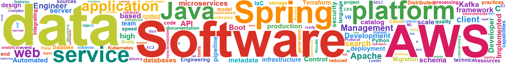

<table width="100%">
  <tr>
    <td>
      <h1>MARIUSZ JURGIELEWICZ</h1>
      
<strong>Software Engineering Leader</strong>

      
📍 Bellevue, WA | ✉️ <a href="mailto:mariusz.jurgielewicz@me.com">mariusz.jurgielewicz@me.com</a>

    </td>
    <td align="right" width="150">
      
    </td>
  </tr>
</table>

## 🎯 SUMMARY

Backend engineer, 15+ years building distributed, JVM-based systems at scale: Java, Spring Boot, Kafka, relational and NoSQL databases, search infrastructure. Recently shifted from writing AI-assisted code to building the platforms other teams’ AI agents run on, MCP servers, embeddings pipelines, hybrid search. I own systems end to end, from architecture through production, and I'd rather ship something that works than sound impressive describing it.

## 💼 EXPERIENCE

### **Senior Software Engineering Consultant** | **Intuit** (Contract)
*Bellevue, Washington (Remote) | July 2024 – Present*

Intuit Persistence Service (IPS) is a high-scale data platform that provides centralized search and data lake capabilities for Intuit’s ecosystem.

**Datalake Platform (Control Plane & Governance)**

* Maintained and enhanced core Java-based API services for the enterprise Datalake control plane, extending metadata management, schema synchronization, and data discovery capabilities across complex, high-scale analytical environments.  
* Integrated Camunda workflow tools to automate end-to-end data governance pipelines, schema evolution, catalog synchronization, and metadata lifecycle management across production workloads.  
* Engineered enterprise-grade Model Context Protocol (MCP) servers using the MCP Software Development Kit (SDK) and Spring AI, exposing secure Datalake metadata, lineage, and catalog APIs to agentic systems (such as Claude Code and Cursor) to automate natural-language context retrieval.  
* Expanded unified schema management by integrating Unity Catalog, Hive Metastore Services, and AWS Glue Data Catalog into a cohesive metadata layer.  
* Engineered advanced Fine-Grained Access Control (FGAC) mechanisms for S3 object storage, continuously improving security postures and enforcing strict least-privilege policies.  
* Optimized platform reliability and developer experience by adding features that streamline data pipeline execution and reduce manual operational overhead for both producers and consumers.  
* Maintained a React/TypeScript admin interface integrating Datalake control-plane management with Intuit's internal developer portal.

**Search Platform (Distributed Retrieval & ML)**

* Optimized JVM performance and garbage collection for high-concurrency microservices, ensuring low-latency retrieval in OpenSearch clusters.  
* Developed high-concurrency Java microservices (Spring Boot, Vert.x) on AWS EKS and EC2, providing low-latency proxy access and robust data ingestion for OpenSearch clusters.  
* Engineered real-time data pipelines using Apache Kafka to ingest data-change events at scale, ensuring search indices remained synchronized with primary data stores.  
* Designed and launched production-grade Retrieval-Augmented Generation (RAG) systems by implementing OpenSearch ML pipelines to generate/store high-dimensional vector embeddings; integrated logging and token tracking to monitor LLM performance and search accuracy.  
* Automated Index & Schema Management using Python-based AWS Lambdas and Step Functions, improving deployment speed and reducing manual configuration errors.  
* Strengthened Security & Compliance by migrating infrastructure to IMDSv2 to prevent SSRF attacks and proactively resolving security vulnerabilities across managed software.  
* Standardized Infrastructure as Code (IaC) using Terraform, AWS CDK (TypeScript), and CloudFormation to provision and scale resilient, multi-region AWS resources.  
* Enhanced Platform Observability by integrating CloudWatch metrics with Wavefront, establishing real-time monitoring and proactive alerting for mission-critical search services.

---

### **Principal Software Engineer** | **Veeva Systems**
*Bellevue, Washington (Remote) | March 2022 – April 2024*

Nitro Data Science and Analytics Platform:

* Served as Technical Lead for the CRM Data Engine (CDE), an event-driven Extract, Transform, Load (ETL) and Online Analytical Processing (OLAP) analytics platform. Led the end-to-end technical architecture, designing a decoupled system utilizing the Claim Check pattern via Amazon S3 and EventBridge/SQS to offload compute to Apache Druid. Managed delivery by breaking the project into modular workstreams and coordinating cross-functional alignment across pipeline state-machine execution, Salesforce Bulk API integration, and SQL query interfaces to deliver a resilient, self-healing pipeline that scaled analytics for enterprise tenants.  
* Automated cloud infrastructure deployments using Infrastructure as Code (IaC) principles with Terraform for AWS resources and Helmfile for Kubernetes deployments.  
* Improved team performance by mentoring junior and mid-level engineers on design patterns and unit testing, which decreased bug occurrence.  
* Implemented coding standards framework that enhanced code quality, reduced bugs, and increased project efficiency.  
* Served as security liaison, managing incident response and coordinating vulnerability assessments with Static Application Security Testing (SAST), Software Composition Analysis (SCA), and Dynamic Application Security Testing (DAST) tools.  
* Identified and addressed technical debt, leading codebase modernization efforts.  
* Resolved critical stability issues in the Java Spring Boot ETL platform by diagnosing thread-pool exhaustion during batch ingestion. Optimized connection pool management and engineered proactive monitoring alerts, eliminating job failures and transforming operational response from reactive to preventative.  
* Managed platform and framework migrations with zero downtime, using tools like OpenRewrite for automated code refactoring.  
* Maintained a React/TypeScript admin interface for the existing ETL engine, giving the team operational visibility and control over data processing workflows.

---

### **Lead Software Developer** | **Logic20/20**
*Seattle, Washington | February 2018 – March 2022*

T-Mobile Social & Messaging Product Development (SMPD):

* Developed Java Spring Boot microservices for an event broker bot, utilizing Apache Kafka for event-driven communication between services, integrating various RESTful APIs, and leveraging DynamoDB for highly scalable data storage and retrieval.  
* Integrated Spring Boot Actuator to gather granular service telemetry, piping metrics to Prometheus and Grafana to build real-time system dashboards and proactive production alerting.  
* Owned and implemented infrastructure as code (IaC) practices within the team, utilizing Terraform to provision AWS resources and customizing Kubernetes YAML manifests with Jsonnet for dynamic deployment generation.  
* Significantly reduced service latency through architectural improvements. This involved migrating from a synchronous REST API model to an asynchronous messaging approach using Apache Kafka, while promoting a more centralized data access approach aligned with the principles of the aggregator pattern to enhance system efficiency.  
* Automated Continuous Integration/Continuous Deployment (CI/CD) pipelines using GitLab to streamline the build, testing, and deployment of microservices, ensuring reliable and frequent releases.  
* Led the migration of numerous microservices from Mesos to Kubernetes.  
* Led the design and deployment of a customer-facing conversational chatbot using the RASA framework, engineering custom Python data-enrichment microservices and MLOps pipelines on AWS SageMaker. To meet a high-stakes, one-month deadline for the Apple New Product Introduction (NPI) launch, led rapid technical training for a team of Java developers in Python and RASA, accelerating their productivity while concurrently building the platform.  
* Developed Python APIs to fetch and enrich data from various sources, enabling chatbots to provide more comprehensive and informative responses.  
* Built an internal admin GUI for the SMPD platform using Angular and Node.js, giving the team operational visibility and control over the customer-facing chatbot and messaging services.

---

### **Associate Staff Software Developer** | **QIAGEN**
*Redwood City, California | March 2015 – January 2018*

* Developed Java EE web application enhancements per customer requests, ensuring production-ready quality.  
* Implemented web and command-line utility status reporting features to enhance visibility into multi-threaded processes.  
* Re-architected common application domain objects, services, and tools into the Grails plugin to enhance code reusability, maintaining synchronization with various Grails platform versions.  
* Conducted ongoing refinement and enhancement of the existing Continuous Integration (CI) framework.  
* Successfully led the migration of key projects to newer versions of the Grails platform, improving system stability and performance.  
* Improved code performance, extensibility, manageability, and testability.  
* Integrated front-end technologies, servlet web frameworks, Hibernate, Spring Framework, and Oracle databases.  
* Collaborated with geographically distributed teams on various development initiatives.

---

### **Senior Software Engineer** | **Xerox Content Management**
*Palo Alto, California | July 2007 – March 2015*

* Developed high-quality, scalable RESTful web services (API) for the Enterprise Content Management server platform using Java and open-source software.  
* Engineered a flexible, high-speed, multi-threaded document intake module enabling upload rates of up to 100 docs/s.  
* Provided technical guidance and mentorship to junior team members.  
* Utilized deep platform knowledge to address development queries across various supported platforms and interfaces.  
* Conducted training sessions for software developers on various technologies through code samples, guides, tutorials, and online resources.

---

### **Senior Software Engineer** | **Saratoga Systems**
*Campbell, California | April 2006 – May 2007*

* **Implemented client UI in C++/C#** and web-based clients using ActiveX and ASP for a line of CRM software products.
* **Used .NET Remoting and web services** to create interfaces for client-server applications.
* **Created full SDLC documentation**, including software requirements specifications, design descriptions, and verification plans.

---

### **Senior Software Engineer** | **Network General**
*San Jose, California | August 2000 – March 2006*

* **Built distributed network monitoring** and analysis products using C++/C#.
* **Worked on communication layers** using DCOM and TCP/UDP protocols, utilizing XSLT for cross-language structure generation.
* **Developed client-side user controls** utilizing third-party charts/grids with ADO.NET data sources.
* **Automated builds and CI** using NAnt, including unit testing, setup generation, and documentation.

---

### **Programmer/Analyst** | **Horizon Computer Consulting**
*Des Moines, Iowa | June 1999 – June 2000*

* **Provided systems consulting**, analysis, and design for client data processing systems.
* **Developed client/server applications** using VB, VBSQL, ODBC, and ADO.

---

### **Software Developer** | **Swiss Soft Ltd**
*Wroclaw, Poland | June 1995 – June 1999*

* **Devised project-controlling systems** for Windows using C++ and Win32 API.
* **Implemented client/server applications** using VB and SQL Server.
* **Localized applications** for international markets (German, English, French, Polish).
* **Prepared installation procedures** and wrote reporting interfaces in C++ and VB.

---

## 🛠 SKILLS

* **Programming Languages:** Java, Python, Groovy, TypeScript, JavaScript, C++, C#, Visual Basic (VB)  
* **AI Frameworks & SDKs:** Spring AI, Model Context Protocol (MCP Java SDK), RASA, OpenSearch ML Vector Embeddings, Semantic Search, Retrieval-Augmented Generation (RAG)  
* **Development Tools & Frameworks:** JVM, Spring Boot, Vert.x, Hibernate, Apache Kafka, Kafka Streams, Apache Thrift, Spring MVC, Spring Cloud, Spring Framework, Grails, GORM, Angular, Node.js, .NET Framework (.NET Remoting), MFC, Win32 API, ActiveX, NAnt  
* **Web Development:** Servlet, JSP, JSF, HTML, HTTP, RESTful API, MVC, JSON, XML, XSLT, OAuth, ASP, SOAP, DCOM, TCP/UDP  
* **Databases & Data Storage:** Spring Data JPA, AWS (S3, DynamoDB, RDS), Redis, ElastiCache, PostgreSQL, H2, JDBC, PL/SQL (Oracle), Redshift, Apache Druid, Microsoft SQL Server, ADO.NET, ODBC, ADO  
* **Cloud & Infrastructure:** AWS (KMS, EC2, EKS, SQS, Step Functions), Docker, Microservices, Load Balancing, Terraform, AWS CDK, CloudFormation, Helm, Helmfile, Jsonnet, Kustomize, Infrastructure as Code, Disaster Recovery, InstallShield  
* **Software Development:** Agile Development, Design Patterns, Distributed Systems, Client-Server Architecture, Network Monitoring, Mentoring, Migration, SaaS, Middleware, Transactions, Data Driven, Object Oriented Design, Debugging, Troubleshooting, Technical Documentation

---

## 🎓 EDUCATION

**Master of Science in Engineering Administration / Data Processing Management Systems**  
**Wroclaw University of Science and Technology**, Wroclaw, Poland
