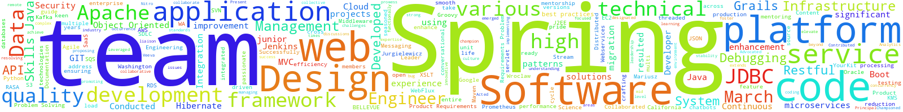

<table>
<tbody>
<tr>
<td><h2><bold>MARIUSZ JURGIELEWICZ</bold></h2></td>
<td></td>
<td><h2><a href="mailto:mariusz.jurgielewicz@me.com">mariusz.jurgielewicz@me.com</a><h2></td>
</tr>
</body>
</table>

## SUMMARY

Principally involved with driving code direction, helping solve problems on the systems side, building out a roadmap to execute on it, rallying the team around this execution plan & executing on the plan itself.
* Work collaboratively with cross-functional teams to design and implement new features
* Drive engineering and operational excellence across backend teams
* Collaborate with other engineering teams to improve processes, surface common pain points, develop solutions and evangelize best practices
* Support, mentor, and help other engineers in the team

A job that will make me better. Whether through challenging assignments, educational opportunities, demanding excellence, or informal mentors.

## EXPERIENCE
**Principal Software Engineer** March 2022 - Present \
**Veeva Systems**, Pleasanton, California \
Nitro data science and analytics platform:
* Collaborated with cross-functional teams including Product Management and Development to contribute to technical design discussions, offering solutions for complex problems in enterprise SaaS cloud applications.
* Actively mentored junior and mid-level engineers, fostering a culture of continuous learning and improvement within the team.
* Successfully broke down intricate problems into actionable solutions, facilitating faster resolutions and improved development efficiency.
* Provided guidance on industry best practices, actively evangelizing coding standards to enhance the overall code quality.
* Served as a designated liaison responsible for handling and addressing security-related matters. Playing a key role in the team's incident response process by being the initial contact person when a security incident occurs. Coordinating efforts related to identifying, assessing, and addressing security vulnerabilities in the team's systems or applications.
* Identified and prioritized technical debt, systematically addressing issues to enhance codebase efficiency. Orchestrated meticulous planning for platform and framework migrations, ensuring seamless transitions with minimal user impact.
> _Java, Spring Boot, Spring Cloud Stream, Spring Data, Hibernate, Querydsl, Flyway, Spring WebFlux, MySQL, AWS, KMS, S3, RDS, EC2, SQS, Amazon Redshift, Amazon EMR, Python, Apache Superset, Apache Parquet_

**Senior Software Developer** January 2018 - March 2022 \
**Logic20/20**, Seattle, Washington \
T-Mobile Social & Messaging Product Development (SMPD):
* Constructed micro-service infrastructure for event broker bot
* Authored and consumed various Restful APIs
* Collaborated with business partners, QA, and other teams on delivering high performance message driven applications.
* Worked on designs and research for new features we would be able to deliver in the future.
* Mentored new developers on the team to make them contributing members.
* Participated in cross‐organization efforts to improve the overall latency of the services.
* Migrated over 150 microservices from Mesos to Kubernetes.
* Designed, developed, debugged, and deployed conversational experiences and solutions using the RASA framework. Integrated RASA-powered chatbots with backend APIs.
> _Java, Spring Boot, Microservices, Spring Cloud, Spring Data JPA, AWS, KMS, S3, DynamoDB, NoSQL, RDS, EC2, SQS, Apache Kafka, Kafka Streams, Docker, Jenkins, Maven, GIT, JSON, Chatbots, Restful API,Agile Development, Architecture, Containerization, Design Patterns, DevOps, Disaster Recovery, Distributed Systems, IAAS, Infrastructure as a Service, Load Balancing, Mentoring, Migration, SAAS, Redis, Elasticache, Terraform,Infrastructure as Code, Oauth, Distributed Architecture, Middleware,Rasa, chatbots, conversational AI, Python_

**Associate Staff Software Developer** March 2015 - January 2018 \
**QIAGEN**, Redwood City, California
* Prepared Java EE web applications enhancements requested by customers and finalized them with a production quality
* Implemented status reporting functionality in existing web and command line utilities to enhance multi-threaded processes visibility.
* Re-architected common application domain objects, services, and tools into Grails plugin to improve code reusability. Kept plugin synchronized with multiple versions of Grails platform.
* Performed continuous refinement and improvement of existing CI framework.
* Migrated multiple projects to the newer version of Grails.
* Increased performance, extensibility, manageability, and testability of the code.
* Integrated front-end technologies, servlet web frameworks, Hibernate and Spring Framework, and an Oracle database.
* Collaborated with geographically distributed teams on multiple development projects.
> _OKBC (Open Knowledge Base Connectivity), Java, Servlet, Hibernate, Groovy, Grails, GORM (Grails Object-Relational Mapping), HTTP (Hypertext Transfer Protocol), Webservices, Convention over configuration, MVC (Model–view–controller), Oracle PL/SQL, Maven, SVN (Apache Subversion), GIT, jQuery, Google Apps Script, HQL (Hibernate Query Language), JSON (JavaScript Object Notation), JSP (Java Server Pages), GSP (Groovy Server Pages), JSF( Java Server Faces), YourKit, OpenBEL (Biological Expression Language), Spring Batch, Jenkins, CI (continuous integration), H2, JDBC (Java Database Connectivity), Spring Framework,Google Apps Script, 
XSLT (Extensible Stylesheet Language Transformations), JUnit, Transactions, Data Driven, _

**Senior Software Engineer** July 2007 – March 2015 \
**Xerox Content Management**, Palo Alto, California
* Built high quality, highly reliable, scalable Restful web services (API) for Enterprise Content Management server platform using Java and open source software. 
* Engineered extensible high-speed multithreaded document intake module that allowed up to 100 docs/s upload rate.
* Provided technical guidance and mentored less experienced team members.
* Used knowledge of the platform to resolve development-related questions across a variety of supported development platforms using many different development interfaces. 
* Trained software developers how to use various technologies through code samples, developer guides, quick starts, tutorials, API reference, quick references, online help, web articles. 
> _Java, Groovy, XQuery, XSLT (Extensible Stylesheet Language Transformations), SPARQL (SPARQL Protocol and RDF Query Language), Restful Webservices (Representational state transfer), Restlet, XML (Extensible Markup Language), JDOM (Java Document Object Model ), XPath (XML Path Language), SAX (Simple API for XML), Google Guice, XForms, RelaxNG, WADL (Web Application Description Language), L34T (Literal-Result-Element-As-Stylesheet), HTML (Hypertext Markup Language ), HTTP (Hypertext Transfer Protocol), TestNG, Mockito,SVN (Apache Subversion), Apache Ant, Eclipse, Git, Jenkins, YourKit, OOP, Object Oriented Programming, Open Source, Unit Test, Object Oriented Design,Support Documentation,Technical Documentation, Middleware_

**Senior Software Engineer** April 2006 – May 2007 \
**Saratoga Systems**, Campbell, California
* Implemented client UI in C++/C# and the web-based clients using ActiveX and ASP for a line of CRM software products. 
* Used .NET Remoting and web services to create interfaces for client-server applications. 
* Created documentation required in the software development process, including software requirements specifications, software design descriptions, verification and validation plans, and other items as required.
> _CRM, C++, C#, .NET, ActiveX, webservices, SOAP (Simple Object Access Protocol)_

**Senior Software Engineer** August 2000 – March 2006 \
**Network General**, San Jose, California
* Built distributed network monitoring and analysis products. Made distributed multi-language client-server Windows application in C++/C#. Worked on communication layer using DCOM and TCP/UDP protocols. Used XSLT transformation to generate structures that can be used both for C/C++ and C# side.
* Made client-side user controls those facilitate some third-party chart, grid, diagramming controls. All controls used ADO.NET tables as the data source.
* Wrote scripts that use NAnt build tool for Continuous Integration, Unit Testing, generating setup, creating documentation, etc. Generated installation programs and deployment procedures for several products using InstallShield or Visual Studio deployment tools.
> _Network monitoring, distributed, client-server , C/C++,C#, MFC, XSLT, (Extensible Stylesheet Language Transformations), Visual Studio, DCOM (Distributed Component Object Model),TCP (Transmission Control Protocol), UDP (User Datagram Protocol), ADO (ActiveX Data Objects).NET, CI (continuous integration), InstallShield, Protocols_

**Programmer/Analyst** June 1999 – June 2000 \
**Horizon Computer Consulting**, Des Moines, Iowa
* Provided system/programming services in the form of consulting, analysis, design, programming and general maintenance of client data processing systems
* Developed client/server applications using VB, VBSQL, ODBC and ADO. 
> _VB (Visual Basic), VBSQL, ODBC (Open Database Connectivity), ADO (ActiveX Data Objects), MS SQL Server_

**Software Developer** June 1995 – June 1999 \
**Swiss Soft Ltd**, Wroclaw, Poland
* Devised project-controlling systems on Windows GUI environment using C++ and Win32 API.  
* Implemented client/server applications using VB and SQL Server.
* Localized applications for customers in German, English, French and Polish speaking markets. 
* Prepared installation procedures for company's software using InstallShield. 
* Wrote interfaces to Crystal Reports in C++ and VB
> _C++, MFC (Microsoft Foundation Class Library), VB (Visual Basic), Crystal Reports, Win32, MS SQL Server, MS Access_

## EDUCATION
**Engineering Administration/Data processing Management Systems, Master of Science** September 1988 – September 1993 \
**Wroclaw University of Technology**, Wroclaw, Poland
